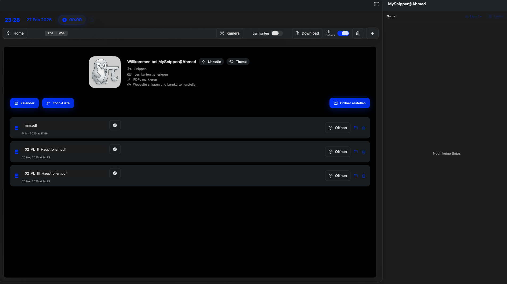
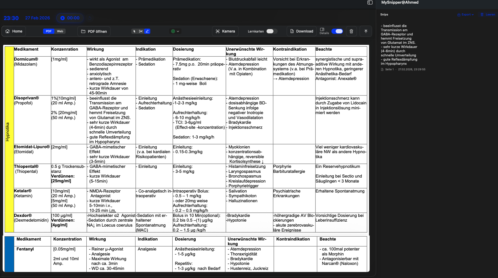
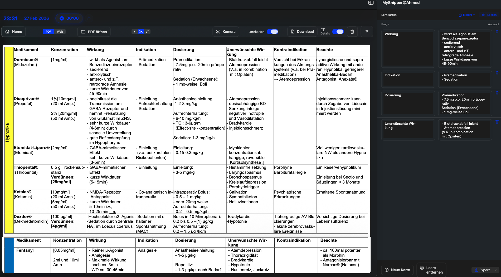

# MySnipper

Native macOS snipping & structured learning tool  
Built with Swift / SwiftUI  
Core codebase private

---

## Overview

MySnipper is a native macOS application designed to streamline PDF-based studying and structured knowledge extraction.

The application enables users to:

- Snip structured content directly from PDFs
- Generate flashcards automatically
- Organize learning material
- Export structured study notes

---

## Architecture

- Swift
- SwiftUI
- Native macOS APIs
- Local data persistence

---

## Screenshots

### Home

### PDF Snipping & Extraction

### Flashcard Generation

